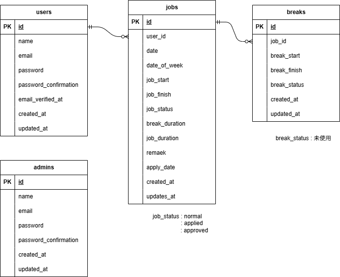

# README

# README.md

# 模擬案件　勤怠管理アプリ

# プロジェクト名: clock-in

GitHubリポジトリURL: [git@github.com:oxnut134/clock-in.git](mailto:git@github.com:oxnut134/frea-market.git)

---

# 1）環境構築

### 1-1 開発環境

### 必要ファイル作成

- **ディレクトリ構築**
- **以下のファイルを作成**
    - docker-compose.yml
    - default.conf
    - Dockerfile
    - php.ini
    - my.cnf

### Dockerビルド

```css
docker-compose up -d --build
```

### PHPコンテナログイン

```bash
docker-compose exec php bash
```

### Composerインストール確認

```

composer -v

```

### Laravelインストール

```lua
composer create-project "laravel/laravel=8.*" . --prefer-dist
```

### 日本時間に変更

`config/app.php　　'timezone' => 'Asia/Tokyo'`

### APP_KEY作成

`php artisan key:generate`

### Laravel起動確認

- ブラウザで `http://localhost` にアクセス

### エラー発生時の対応

```jsx
chmod -R 775 storage
chown -R www-data storage
```

---

### 1-2 Database

### MySQLコンテナログイン

```bash
docker-compose exec mysql bash
```

### MySQL起動

```css
mysql -u laravel_user -p
```

- **パスワード入力**

### Database確認

```
show databases;

```

### `.env`ファイル編集

```
DB_CONNECTION=mysql
DB_HOST=mysql
DB_PORT=3306
DB_DATABASE=laravel_db
DB_USERNAME=laravel_user
DB_PASSWORD=laravel_pass

```

### 1-3 マイグレーション

### マイグレーション実行

```
php artisan migrate

```

### 実行順（参考）

1. 2014_10_12_000002_create_users_table.php
2. 2014_10_12_100002_create_password_resets_table.php
3. 2014_10_12_200002_add_two_factor_columns_to_users_table.php
4. 2019_08_19_000002_create_failed_jobs_table.php
5. 2025_07_27_143348_create_admins_table.php
6. 2025_08_11_061133_create_jobs_table.php
7. 2025_08_12_061256_create_breaks_table.php

---

### 1-4 シーディング

### シーディング実行

```
php artisan db:seed

```

### 実行対象

実行されるのは以下の３シーダーです。

- **UsersTableSeeder**
- **AdminsTableSeeder**
- **JobsAndBreaksTableSeeder**※１

 **** 　※１　jobsテーブルとbreaksテーブルへのシーディングが一度で行えます。

　  ****※UsersTableSeeder、AdminsTableSeederはそれぞれの単体シーディング用

---

### 1-5 Mailhog設定

### `.env`ファイル編集

```
MAIL_MAILER=smtp
MAIL_HOST=mailhog
MAIL_PORT=1025
MAIL_USERNAME=null
MAIL_PASSWORD=null
MAIL_ENCRYPTION=null
MAIL_FROM_ADDRESS=admin@test.com
MAIL_FROM_NAME="${APP_NAME}"

```

---

### 1-6 テストコード

### /config/database.php追記

```diff
 'mysql_test' => [

　　　　　　　ー 略 ー

             'database' => 'clock_test',
             'username' => 'root',
             'password' => 'root',

　　　　　　　ー 略 ー

             ]) : [],
 ],
```

### .env.testing
.envをコピー・編集

```diff
 APP_ENV=test
 APP_KEY=
```

```bash
DB_CONNECTION=mysql
DB_HOST=mysql
DB_PORT=3306
DB_DATABASE=clock_test
DB_USERNAME=root
DB_PASSWORD=root
```

### APP_KEY 作成

### テスト用テーブルのマイグレーション

```
コピー
php artisan key:generate --env=testing
php artisan config:clear
```

```
php artisan migrate --env=testing
```

### テストコード実行

```
php artisan test
```

### テストコード一覧

**①認証機能(一般ユーザー)　                       StaffRegisterValidationTest.php
②ログイン認証機能(一般ユーザー)            StaffLoginValidationTest.php**
③**ログイン認証機能(管理者)                       AdminLoginValidationTest.php
④日時取得機能　　　　                             StaffCurrentDateAndTimeDisplayTest.php
⑤ステータス確認機能　                             StaffStatusDisplayFunctionTest.php
⑥出勤機能　　　　                                    StaffClockInFunctionTest.php
⑦休憩機能　　                                            StaffBreakInFunctionTest.php
⑧退勤機能　　　　　                                 StaffClockOutFunctionTest.php
⑨勤怠一覧情報取得機能(一般ユーザー)　 StaffAttendanceListFunctionTest.php
⑩勤怠詳細情報取得機能(一般ユーザー)　 StaffMyDetailDisplayedFunctionTest.php
⑪勤怠詳細情報修正機能(一般ユーザー)　 StaffMyDetailAppliedToUpdateTest.php
⑫勤怠一覧情報取得機能(管理者)　　　     AdminStaffAttendanceLIstFunctionTest.php
⑬勤怠詳細情報取得・修正機能(管理者)     AdminOperateAttendanceDetailTest.php
⑭ユーザー情報取得機能(管理者)　　        AdminGetStaffInformationTest.php
⑮勤怠詳細情報修正機能(管理者)　　        AdminUpdateStaffAttendanceTest.php
⑯メール認証機能　　　　　　　　           StaffEmailVerificationTest.php**

# 2）利用技術

- **Docker**: 27.5.1
- **PHP**: 7.4.9
- **MySQL**: 8.0.26
- **Nginx**: 1.21.1
- **phpMyAdmin**
- **Laravel Framework**: 8.75
- **Laravel Fortify**: 1.19
- **Mailhog**: latest

---

# 3）ER図

image.png

---



# 4）URL

- **開発環境**: [http://localhost/](http://localhost/)
- **Laravel公式ドキュメント**: [Laravel Fortify - Laravel 12.x](https://laravel.com/docs/12.x/fortify)
- **Mailhog**: [https://gitub.com/mailhog/MailHog](https://github.com/mailhog/MailHog)

# 5）追記事項

①勤怠登録画面（出勤前）で出勤ボタンをクリックした際に、前回の出勤から日が空いている場合
　には、休みとみなし、空いている日付分のレコードが日付情報のみで作成されます。